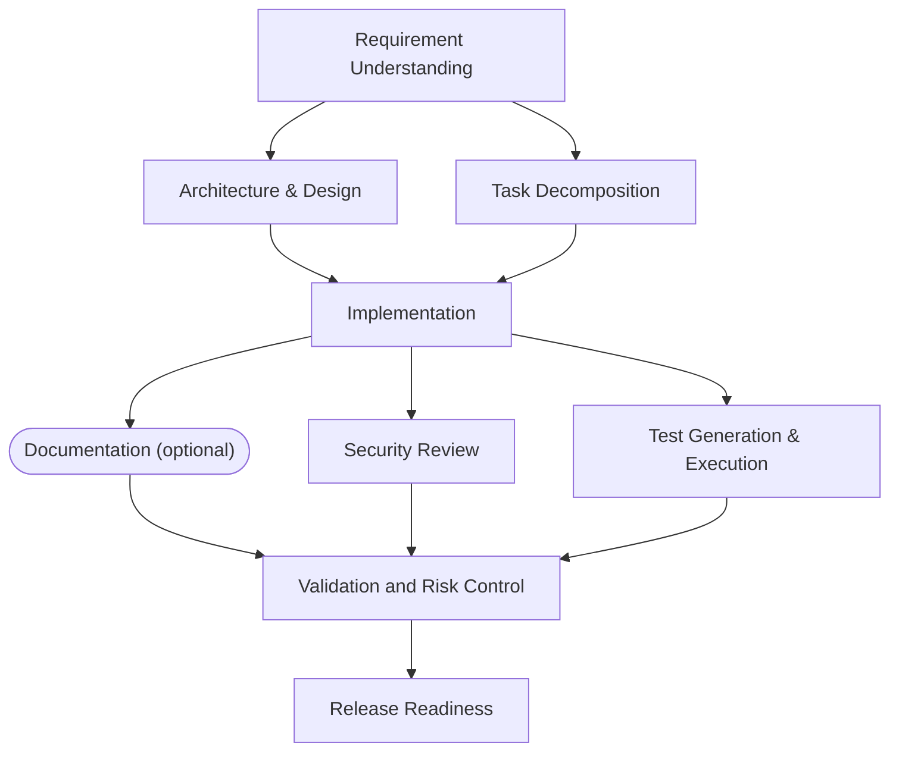

# Architecture

This document covers the orchestration layer's components, its execution and
governance model, control flow, and the key design decisions behind it.

For the three demo scenarios with real transcripts, see [SCENARIOS.md](SCENARIOS.md).
For testing approach and known limitations, see [TESTING.md](TESTING.md).
For the project-level engineering summary, see [ENGINEERING_SUMMARY.md](ENGINEERING_SUMMARY.md).

## 1. What this is

Two things live in this repository:

1. **The orchestrator** (`orchestrator/`) — an agentic execution engine that
   drives a requirement through the full SDLC (requirements → architecture →
   planning → implementation → testing → security → docs → validation →
   release) under explicit governance: dependency graph, gates, policy
   guardrails, human approval checkpoints, bounded retry/fallback/rollback,
   audit trail, reliability metrics, dynamic re-planning.
2. **The target system** (`target/`) — a URL shortener service, generated
   *by* the orchestrator, not hand-written. Running `asdlc build` against a
   requirement statement reproduces it (or a variant of it) from scratch.

The orchestrator is deliberately generic — nothing in `orchestrator/core/`
knows what a URL shortener is. Domain knowledge lives entirely in the nine
stage agents (`orchestrator/agents/`); the engine, gates, policy, resilience
and approval machinery would run an entirely different SDLC pipeline
unchanged.

## 2. Components

```
orchestrator/
  contracts.py         domain vocabulary every stage speaks (Requirement,
                        NormalizedRequirement, Task, Artifact, Finding,
                        Decision, StageResult) — frozen Pydantic models
  config.py             OrchestratorConfig, AutonomyLevel, RetryPolicy
  cli.py                `asdlc`: build / status / resume / clarify

  core/
    graph.py             StageNode, StageGraph — the DAG, validated at
                          construction (cycles, dangling deps, data-flow)
    engine.py             the frontier-scheduling execution engine
    gates.py               entry/exit gate predicates
    state.py                 RunState, StageState, ContextStore
    ledger.py                 append-only, hash-chained audit trail
    policy.py                  universal security/compliance/change-control
                                 guardrails, evaluated on every stage
    approvals.py                human approval checkpoints (providers,
                                  ApprovalPolicy, ApprovalLog)
    resilience.py                retry classification, fallback strategies,
                                   cross-stage rollback planning
    replanning.py                 dynamic re-planning scoped by context
                                    read-attribution
    metrics.py                    reliability report (success rate,
                                    retry/rollback frequency, MTTR, latency)
    workspace.py                  sandboxed, snapshot/restorable filesystem

  providers/
    base.py            Provider interface — one method, free text in/out
    deterministic.py    the reproducible default (no network, no fabrication)
    anthropic_client.py  real-model provider (optional `anthropic` dependency)

  agents/               the nine SDLC stage agents (Section 5)
```

## 3. The orchestration model

### 3.1 Explicit dependency graph, not a linear chain

`StageGraph` is a DAG. The default graph (`orchestrator/agents/__init__.py:
build_graph()`) is:



Two independent fan-outs: `architecture`/`planning` off `requirements`, and
`testing`/`security`/`docs` off `implementation`. `validation` is an
`ALL`-join synchronization barrier — it does not dispatch until every one of
its three dependencies is *satisfied* (succeeded or, for the optional `docs`
node, skipped without breaking the graph behind it).

Construction validates the graph before any agent runs: cycles are detected
and named in the error, dangling dependencies are rejected, and nodes
declare the context keys they `consume`/`produce` so a stage that would
consume a key no ancestor produces is rejected statically — not discovered
three stages downstream as a `None`.

### 3.2 Frontier scheduling, not layer-by-layer

The engine (`Engine._dispatch`) is not a topological-layer walker. On every
tick it dispatches whichever stages are currently ready and awaits the
*first* completion (`asyncio.wait(..., FIRST_COMPLETED)`), so a fast branch
never idles behind a slow sibling in the same nominal layer. In the greenfield
scenario transcript, `testing` (which runs a real pytest subprocess, ~0.3–0.4s)
and `security`/`docs` (a few ms each) all fan out from `implementation`
simultaneously; the two fast branches complete and their descendants become
eligible while `testing` is still running.

Synchronization happens exactly where the graph says it should — at an
`ALL`-join node like `validation` — not implicitly at every layer boundary.

### 3.3 Per-stage transactionality

Every dispatch snapshots the workspace immediately before the attempt.
Artifacts are written to the real workspace so exit gates and policy rules
can inspect actual files, but if anything downstream rejects the result, the
pre-attempt snapshot is restored and nothing is folded into `RunState`. A
stage therefore either lands completely or leaves no trace, which is what
makes retry, fallback and rollback compositions safe rather than merely
hopeful.

### 3.4 The governance pipeline

A single stage attempt passes through, in order:

```
executor → artifact sealing → exit gates → universal policy → approval checkpoint
```

Any stage of that pipeline can reject the attempt:

| Stage | Rejects when | Retryable? |
|---|---|---|
| exit gates | a node-specific postcondition fails (e.g. `PromisedOutputGate`: declared a context key, didn't produce it) | classified `PERMANENT` — a deterministic re-run won't fix a deterministic output |
| universal policy | a `BLOCKER`-severity guardrail fires (hardcoded secret, SQL injection, frozen-path write) | classified `POLICY` — never retried |
| approval checkpoint | a human (or an automated policy provider) rejects | classified `POLICY` — never retried |
| the executor itself | raises (timeout, connection error, ...) | classified by message/type — `TRANSIENT`/`RATE_LIMITED` retry with backoff, `PERMANENT` does not |

`resilience.classify()` is what turns a raw exception into a retry decision;
retrying a `StageRejected` (an agent's deterministic output failing a
postcondition) would just reproduce the same failure, so it is never
retried — only a `FallbackStrategy`, if the node declares one, gets a try
after the retry budget is exhausted.

### 3.5 Human approval checkpoints

`ApprovalPolicy` derives whether a checkpoint is required from three inputs
the agent does not control: the configured `AutonomyLevel`, the node's
declared `high_impact`, and the assessed risk (from the normalized
requirement and the stage's own findings). Precedence is deliberate: a
node's `high_impact=True` overrides configured autonomy, so raising autonomy
to `AUTONOMOUS` can never silently switch off the checkpoint on `release` —
verified directly in `tests/orchestrator/test_governance.py::
test_high_impact_release_requires_approval_even_under_full_autonomy`.

A checkpoint with no answer yet does not fail the stage — it raises
`ApprovalPending`, which preserves the already-gated-and-policy-checked
result and halts the run in `AWAITING_APPROVAL`. `Engine.resume()` reloads
that result and resolves the checkpoint **without re-invoking the
executor** — an approval decision must not depend on an agent reproducing
byte-identical output twice.

### 3.6 Dynamic re-planning: two distinct primitives

Two different situations both count as "the plan needs to change," and they
are handled by two different engine methods because they have genuinely
different information available:

- **`Engine.replan(state, changed_keys)`** — a stage that already succeeded
  and had real consumers changes its output (e.g. a design decision is
  revised). `ContextStore` already tracks who *read* each key
  (`consumers_of()`), so the re-run scope is computed precisely: exactly the
  stages that consumed the stale value, plus their descendants. A sibling
  branch that never touched the changed key is left untouched.

- **`Engine.retry_stage(state, stage_name)`** — a stage's own entry gate
  refused it outright, so there is no prior successful value to diff
  against. The canonical case is a blocking ambiguity:
  `NoBlockingAmbiguityGate` holds `architecture` and `planning` *before*
  either ever reaches the engine's pre-read of its declared `consumes`, so
  they never register as consumers and `compute_scope()` has nothing to
  find. `retry_stage` resets the named stage plus everything currently
  `BLOCKED` or `SKIPPED` (an optional stage bypassed only because its own
  dependency was unreachable) and re-enters the dispatch loop.

`asdlc clarify` is `retry_stage` from the CLI: it replaces the run's
requirement statement with a human's clarified restatement and retries from
`requirements`. See [SCENARIOS.md](SCENARIOS.md#scenario-3-ambiguous) for a
full transcript.

### 3.7 Cascading rollback

`StageNode.rollback_with` declares stages coupled to this one such that a
failure here invalidates them too, even if they ran on an independent
parallel branch and already succeeded (e.g. a security review failing
should invalidate a documentation stage built on the same artifact). On a
stage's terminal failure, `Engine._cascade_rollback` restores each coupled
stage's own pre-attempt snapshot and marks it `ROLLED_BACK` rather than
leaving it looking like a success.

### 3.8 Audit trail and reliability metrics

Every event the engine emits — stage transitions, gate decisions, policy
evaluations, approvals, retries, rollbacks, artifacts, decisions, findings —
goes through `Ledger.append()`, which chains each event's hash to the
previous one. `Ledger.verify()` re-derives every hash on read; editing or
dropping a historical event breaks the chain at that point and every event
after it. This is what "audit-grade" means concretely: a reviewer does not
have to trust the log, they can verify it.

A real greenfield run produces 88 such events across 9 stages (21 artifacts
written, 12 decisions recorded with rationale, 9 policy evaluations, 1
approval) with an intact chain — see
[SCENARIOS.md](SCENARIOS.md#scenario-1-greenfield) for the actual histogram.

`orchestrator/core/metrics.py` computes success rate, retry/rollback
frequency, MTTR and end-to-end latency from `RunState` + the ledger *after
the fact*, so the numbers can never drift from what actually happened — see
`engine.metrics(state)`.

## 4. Control flow: one stage attempt

```
Engine._dispatch
  → entry gates pass?  (RequiredContextGate, NoBlockingAmbiguityGate, ...)
      no  → BLOCKED, cascades to descendants via _settle()
      yes → snapshot workspace, dispatch Engine._run_stage as an asyncio.Task

Engine._run_stage  (bounded retry loop)
  attempt 1..N:
    Engine._attempt_stage
      → await executor(node, state)          # the agent itself
      → Engine._finalize_attempt
          → seal artifacts into the workspace
          → exit gates                        (reject → StageRejected)
          → universal policy                  (BLOCKER → PolicyRejected)
          → approval checkpoint if required    (pending → ApprovalPending,
                                                 rejected → ApprovalRejected)
      on success: return the StageResult
      on ApprovalPending: propagate untouched (no rollback — preserved for resume)
      on any other exception:
        classify failure  → retry?  → sleep, next attempt
                           → no     → fallback declared? → try once
                                     → StageExhausted, roll back the attempt

Engine._resolve  (on task completion)
  success            → absorb into RunState (artifacts, context, decisions, findings)
  ApprovalPending     → AWAITING_APPROVAL, halt
  NEEDS_REPLAN outcome → halt, awaiting Engine.replan()
  failure             → FAILED (or SKIPPED if optional), cascade rollback,
                         halt if critical or governance-mandated
```

## 5. The nine stage agents

Each agent is an `async (StageNode, RunState) -> StageResult` — the entire
contract the engine cares about. All nine share `Agent.think()`
(`orchestrator/agents/base.py`): ask the bound `Provider` for JSON, and on
*any* failure — no provider, a network error, or a response that isn't valid
JSON — fall back to a deterministic heuristic. Callers never branch on which
of those happened.

| Stage | Produces | Notable behavior |
|---|---|---|
| `requirements` | `NormalizedRequirement` (scope, functional/non-functional, acceptance criteria, ambiguities) | Only capabilities the requirement actually asks for enter the functional list — an unrequested capability is left out of scope with a recorded assumption, not silently built. A genuinely vague statement is flagged as a *blocking* ambiguity. |
| `architecture` | API spec, design decisions | For brownfield runs, scans the seeded workspace's actual source files (docs/reports excluded) for keyword overlap with the raw requirement and reports impacted files — real codebase reasoning, not asserted. |
| `planning` | Dependency-ordered `Task` list | Optional tasks (alias, expiry, stats, rate-limit) are included only when `requirements` put them in scope — planning stays in lockstep with what was actually decomposed. |
| `implementation` | The FastAPI service source | Deterministic, plain-string templates (not f-strings — the generated code is itself full of `{}`), gated by exactly the capabilities `planning` decomposed. |
| `testing` | pytest suite + **actual execution** | Generates the suite *and* runs it in a real subprocess against the materialized workspace. A generated test nobody ran is a to-do, not validation. |
| `security` | Security review report | Re-evaluates the universal policy rules as one batch over every accumulated artifact (not per-file — see [TESTING.md](TESTING.md) for the bug that taught this), plus a cross-cutting review (missing rate limiting, no auth, unrestricted URL schemes). |
| `docs` | README | Optional; documents only the endpoints actually implemented, not an aspirational API. |
| `validation` | Risk register | Synthesizes ambiguity assumptions, test results and security findings into one document — the evidence a release approver actually needs. |
| `release` | Final engineering summary | The graph's `high_impact` node — the mandatory human checkpoint, under every autonomy level. |

## 6. Key design decisions

- **Deterministic-first, LLM-optional.** The default `DeterministicProvider`
  never fabricates structure it can't back (it returns `{}` for a JSON ask,
  triggering the agent's own fallback) rather than inventing plausible
  answers. Every agent runs identically — just with different fidelity —
  whether or not `ANTHROPIC_API_KEY` is set. This keeps the whole system
  reproducible and CI-safe by default, while a real model is a config change
  away.
- **Contracts are frozen Pydantic models with `extra="forbid"`.** A stage's
  output either matches the schema exactly or the run fails loudly at
  construction — no silent partial objects drifting through the pipeline.
- **Agents never mutate `RunState`.** They return a `StageResult`; the
  engine decides admissibility. That separation is the autonomy boundary —
  structural, not a convention someone can forget.
- **Policy is engine-enforced, not opt-in.** Security/compliance/change-
  control guardrails run on every stage's output regardless of whether that
  node declared any exit gates. A guardrail you can forget to wire up is not
  a guardrail.
- **Two distinct re-planning primitives** (`replan` vs. `retry_stage`) rather
  than forcing one abstraction to cover both a value-diff and a gate-refusal.
  Trying to unify them would have hidden a real information difference:
  `replan` has a prior value to diff against and precise consumer
  attribution; `retry_stage` has neither.

## 7. Setup

See the root [README.md](../README.md) for install and quick-start
instructions.
